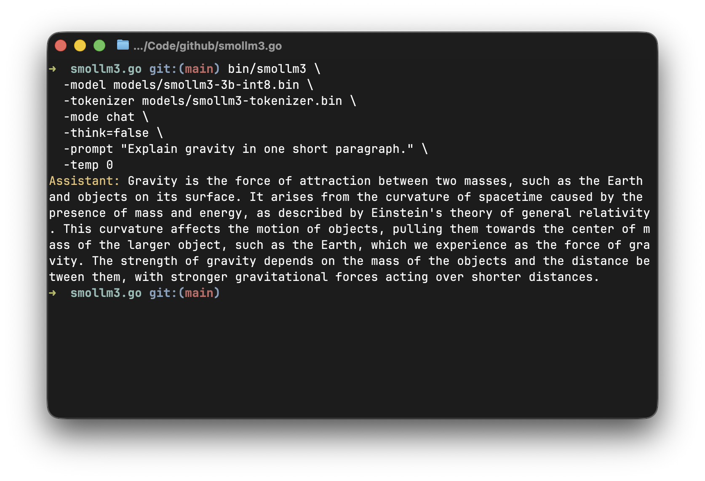

# smollm3.go

A small, readable Go runtime for [SmolLM3-3B](https://huggingface.co/HuggingFaceTB/SmolLM3-3B) local inference, with tokenizer, int8 weight-only quantization, KV cache, and ARM64/amd64 SIMD kernels.

Inspired by [llama2.c](https://github.com/karpathy/llama2.c) and adapted from the [smollm2.go](https://github.com/zhuyie/smollm3.go) implementation.



## Layout

```text
cmd/smollm3/          CLI entry point
internal/model/       SML3 loader, weights, KV cache, forward pass
internal/tokenizer/   TOK3 loader and byte-level BPE tokenizer
internal/sampler/     greedy, multinomial, and top-p sampling
tools/                Hugging Face model/tokenizer export scripts
docs/CHECKPOINT.md    SML3/TOK3 binary format notes
```

## Prepare Python Environment

The export scripts need `torch`, `transformers`, `sentencepiece`, `safetensors`,
`accelerate`, and `numpy`.

```sh
python3 -m venv .venv
.venv/bin/python -m pip install --upgrade pip torch transformers sentencepiece safetensors accelerate numpy
```

SmolLM3 requires recent Transformers support. Use `transformers>=4.53`.

## Export Model And Tokenizer

```sh
mkdir -p models

.venv/bin/python tools/export.py models/smollm3-3b-f32.bin \
  --hf HuggingFaceTB/SmolLM3-3B

.venv/bin/python tools/export_tokenizer.py models/smollm3-tokenizer.bin \
  --hf HuggingFaceTB/SmolLM3-3B
```

To convert the FP32 checkpoint to weight-only int8:

```sh
.venv/bin/python tools/quantize.py \
  models/smollm3-3b-f32.bin \
  models/smollm3-3b-int8.bin
```

## Build

```sh
mkdir -p bin
go build -o bin/smollm3 ./cmd/smollm3
```

## Benchmark

Using:

```sh
go test ./internal/model -bench='Benchmark(Prefill|Decode)' -benchtime=1x -run '^$'
```

Reference results on an Apple M2 Max:

| Benchmark | FP32 | Int8 |
| --- | ---: | ---: |
| Prefill 128 tokens | 29.61 tok/s | 64.50 tok/s |
| Prefill 512 tokens | 26.70 tok/s | 53.38 tok/s |
| Decode at 128-token context | 6.517 tok/s | 20.74 tok/s |
| Decode at 512-token context | 6.441 tok/s | 17.89 tok/s |

Reference results on Windows/amd64 with an AMD Ryzen 9 9950X:

| Benchmark | FP32 | Int8 |
| --- | ---: | ---: |
| Prefill 128 tokens | 62.07 tok/s | 99.45 tok/s |
| Prefill 512 tokens | 52.72 tok/s | 84.39 tok/s |
| Decode at 128-token context | 3.418 tok/s | 11.69 tok/s |
| Decode at 512-token context | 3.356 tok/s | 11.29 tok/s |

## Run

Generate plain continuation text:

```sh
bin/smollm3 \
  -model models/smollm3-3b-int8.bin \
  -tokenizer models/smollm3-tokenizer.bin \
  -mode generate \
  -n 128 \
  -prompt "The galaxy empire" \
  -temp 0
```

Run a single chat turn:

```sh
bin/smollm3 \
  -model models/smollm3-3b-int8.bin \
  -tokenizer models/smollm3-tokenizer.bin \
  -mode chat \
  -prompt "Give me a brief explanation of gravity in simple terms." \
  -temp 0
```

Disable thinking:

```sh
bin/smollm3 \
  -model models/smollm3-3b-int8.bin \
  -tokenizer models/smollm3-tokenizer.bin \
  -mode chat \
  -think=false \
  -system "Answer as concisely as possible. For arithmetic, give only the equation and result." \
  -prompt "What is 2+2?" \
  -temp 0
```

Run the built-in tool-calling demo:

```sh
bin/smollm3 \
  -model models/smollm3-3b-int8.bin \
  -tokenizer models/smollm3-tokenizer.bin \
  -mode toolcall \
  -prompt "I have 40 dollars. Can I buy 3 notebooks, and how much money would be left?" \
  -temp 0
```

## Use As A Library

Other Go programs can import the root package and call the runtime directly:

```go
package main

import (
	"context"
	"fmt"
	"log"

	"github.com/zhuyie/smollm3.go"
)

func main() {
	client, err := smollm3.Load(smollm3.Config{
		ModelPath:     "models/smollm3-3b-int8.bin",
		TokenizerPath: "models/smollm3-tokenizer.bin",
	})
	if err != nil {
		log.Fatal(err)
	}

	text, stats, err := client.Generate(context.Background(), "The galaxy empire", smollm3.GenerateOptions{
		MaxNewTokens: 128,
		Temperature: 0,
	})
	if err != nil {
		log.Fatal(err)
	}
	fmt.Printf("%s\n%.2f tok/s\n", text, stats.TokensPerSecond())
}
```

For chat-style prompts, use `client.Chat` with a message history:

```go
reply, _, err := client.Chat(context.Background(), []smollm3.Message{
	{Role: "user", Content: "Give me a brief explanation of gravity."},
}, smollm3.ChatOptions{
	GenerateOptions: smollm3.GenerateOptions{MaxNewTokens: 128, Temperature: 0},
	Thinking:        true,
})
```

`GenerateOptions.TokenCallback` receives decoded token pieces as they are produced, which is useful for streaming responses into an application UI. A loaded client owns mutable model state, so do not call generation methods concurrently on the same client.
